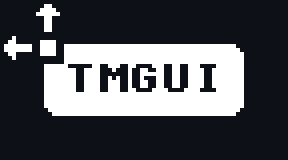

**TMGUI** is a minimalistic 'TextMode' IMGUI (Immediate Mode GUI) API being developed in C with Raylib at its core (https://www.raylib.com/). Designed for pixel-perfect grid-based interfaces, tile-based games/toys/tools, and text-mode aesthetics. Inspired by old-school OS interfaces, terminal displays and the modern TextMode art movement.<br> 
**TMGUI** emphasizes predictability, simplicity and total layout control with a DSL like syntax for layout code.


## Features
**Grid-Based Layout and Container Support**  
- Fixed cell dimensions (`cell_w`, `cell_h`) defined with `tm_init(w,h)` 
- Grid-rect based positioning with optional placement macros for use inside v/hboxes 
- Supports `AUTO` (full auto), `POS(x,y)` (manual pos, auto size) and `SIZE(w,h)` (auto pos, manual size)
- In `AUTO` or `POS(x,y)` mode, an elements width expands in `tm_vbox`, and height expands in `tm_hbox`  

**Grid-Based Pixel-Perfect Canvas Autoscaling**
- Define your tile dimentions with `tm_init(w,h)` 
- Define the canvas grid dimensions with `tm_canvas_init(w,h,trans)` (80x45 = 16:9)
- The auto scaling sizes your canvas to fit the current window size, adding letter/pillarboxing where needed
- Canvas will only scale to pixel perfect multiples, no weird artefacts! 
- Supports `tm_vbox(...)` and `tm_hbox(...)` with deterministic cursor-based layout  
- Simple lat layout system, no nested containers — one container at a time! 

**Basic Primitives**  
- `tm_label(...)`, `tm_button(...)`, `tm_rect(...)`, `tm_text(...)`, `tm_drawtile(...)`  

**Text Alignment and Element Spacing Support**
- Align text in Labels and Buttons!  
- Controlled via `ALIGN(RIGHT,CENTER)`, `ALIGNH(RIGHT)`, `ALIGNV(TOP)` macros  
- Space out elements in a vbox/hbox!
- Controlled via `tm_add_spacing(1)` to overide the current spacing  

**Style System**  
- `tm_style` struct encapsulates styling (foreground, background, border color and width), font and button states (`normal`, `hover`, `active`)  
- Per-element style support using `tm_set_style()` to set the global `current_style` 
- Per-element font overide using `tm_set_font()`
- Easily define reusable themes  

**Simple GUI layout syntax**  
- Clean syntax for GUI layout:  
  
```c
tm_canvas canvas = tm_canvas_init(80, 45, false);
tm_canvas_begin(&canvas);

	tm_vbox(RECT(2, 2, 20, 0));
		tm_button("Play Game", AUTO);
		tm_set_spacing(2);
		tm_button("Options", AUTO);
		tm_button("Exit", AUTO);

		tm_align(ALIGN(CENTER, TOP));
		tm_label("Centered Title", SIZE(30, 1));

tm_canvas_end(&canvas);
```
 **No Dynamic Allocation**

- No `malloc`s — all layout state is static and explicit.

**Zero Dependencies Beyond Raylib**

- Pure **C99**
- **Raylib** handles rendering, input, and font loading

🛠️**Planned Features**

-  Scroll marquee for clipped label text  
-  Input widgets (text field, slider, checkbox, spinbox, int/float input, dropdowns)
-  Scrollable areas (vertical and horizontal, with regular and log style scroll modes)
-  Tile based panels/buttons/labels
-  Animated tile support
-  Tooltip support
-  Expandable/collapsable panels
-  And much more!

---

📄 **License**

**MIT**

## Author

**Jacob Holland**  
Made with love.


